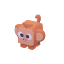
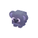
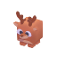
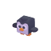
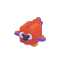

<p align="center">
  
  
  
  
  
  
  
  
  
</p>
<h1 align="center">Focus Island</h1>

> **Hackathon POC — Tom Angles, 06/05/2026**

Focus Island is a multiplayer productivity game: stay focused on your work, earn coins, unlock animals, and decorate your virtual island. Join a lobby with your teammates, get to work, and compare islands at the end of the session.

The idea is not to spend time in the app — it's to work, let the app detect your focus automatically, and come back at the end of the day to see who built the best island.

---

## How it works

1. Open the web client and enter your name.
2. Create a lobby or join one with a friend's code.
3. Work. The app automatically detects whether you're focused based on the active browser tab.
4. Every second of focus generates coins — spend them on animals and decorations in the shop.
5. At the end of the day, visit your teammates' islands and compare your progress.

---

## Quick start

```bash
# Lobby server
cd server
npm install
npm start   # port 3001

# Web client
cd client
npm install
npm run dev   # port 5173
```

---

## Features

- 🌍 **3D world** — floating islands in Three.js, free camera, auto-rotate during focus
- 🎨 **Unique biomes** — 5 biomes per player (verdant, snow, desert, volcanic, sakura)
- 🐾 **24 animals** — unlockable with coins, smooth animations
- 🌿 **Decorations** — plants, trees, mushrooms, flowers with passive income
- 🔥 **Social focus** — see in real time who's working in the lobby
- 🗺️ **Minimap** — quick navigation between islands
- 🎵 **Lofi music** — automatic fade in/out when focus starts
- 🌙 **Day/night cycle** — based on total accumulated focus time
- 🏆 **Leaderboard** — live ranking by focus time
